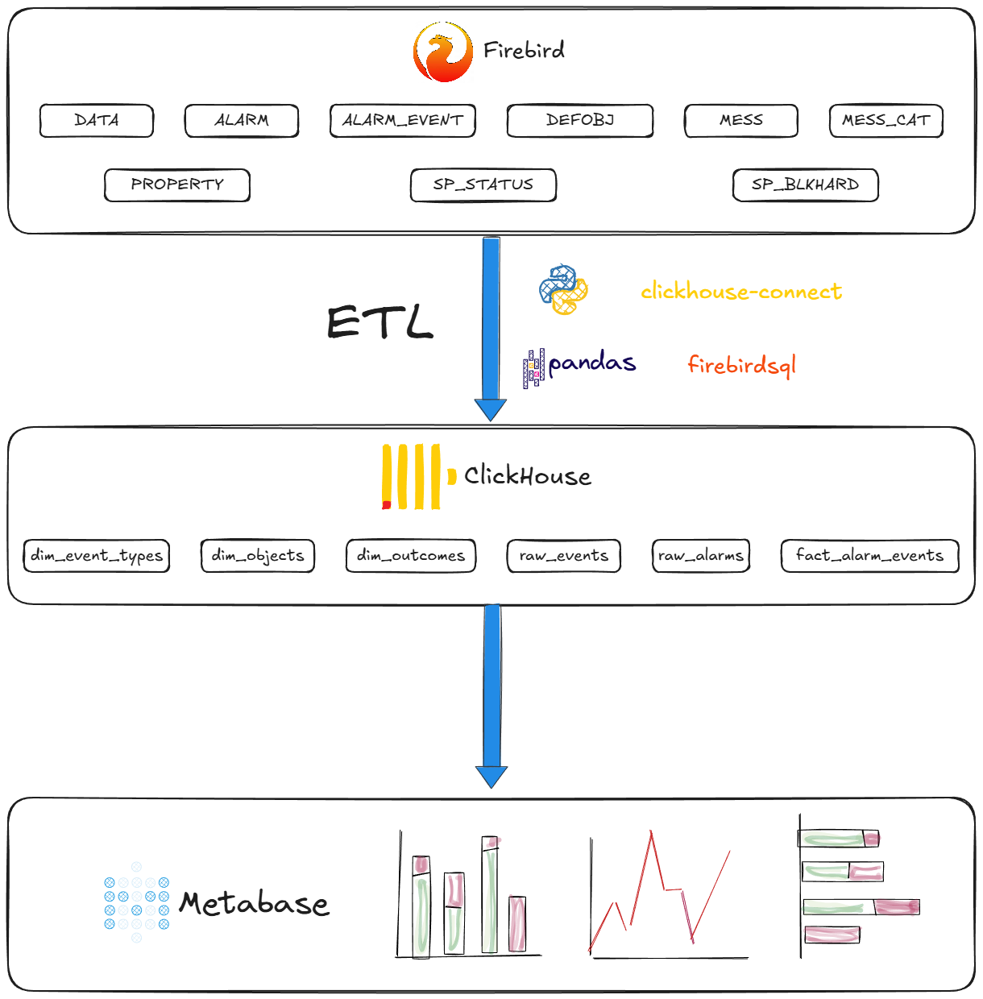

# 🛡 Struna-5 Analytics

> ETL-пайплайн для анализа данных охранно-пожарной сигнализации  
> **Firebird → ClickHouse → Metabase**

---

## О проекте

**Задача:** Построение аналитического слоя на основе данных из системы «Струна-5». Исходная БД продолжает работать — данные копируются в ClickHouse для удобных отчётов и дашбордов.

| Параметр | Значение |
|----------|----------|
| **Источник** | Firebird 2.1 (архив 2017–2019) |
| **Объём** | ~650K событий, ~67K инцидентов |
| **Хранилище** | ClickHouse 23.8 (6 таблиц) |
| **Визуализация** | Metabase / Grafana |

---

## 🏗️ Архитектура



**Ключевые решения:**

- Денормализация справочников (меньше JOIN в дашбордах)
- Анонимизация ключей: `SHA256(GRP-MDM)[:8]`
- 5% событий без объекта → маркируем флагом, не фильтруем
- Маскировка ПДн (адреса, названия)

---

## 🚀 Быстрый старт

```bash
# 1. Клонирование
git clone https://github.com/sempad-itm/struna_analytics.git
cd struna-analytics

# 2. Запуск инфраструктуры
docker-compose up -d

# 3. Добавление исходных данных 
Положите ваш архив базы данных (`.fbk`) в папку `./data/firebird/`:

# Пример: скопируйте ваш файл и переименуйте для удобства
cp ~/путь/к/архиву/имя_файла.fbk ./data/firebird/struna_backup.fbk

# 4. Восстановление базы Firebird из архива

# Выполните восстановление внутри контейнера:
docker exec -it struna-firebird bash -c \
  "/opt/firebird/bin/gbak -c -v -user sysdba -password masterkey /db/struna_backup.fbk /db/struna.fdb"

# 5. Создание таблиц
docker-compose exec clickhouse clickhouse-client < sql/create_tables.sql

# 6. Загрузка данных
cd etl && pip install -r requirements.txt && python src/load_data.py

# 5. Дашборды
Откройте в браузере:
- **Metabase**: http://localhost:3000
```

---

## Data Quality

| Проблема | Решение |
|----------|---------|
| 5% событий без объекта | Флаг `has_object_ref` |
| Тестовые ключи (GRP=0) | Маркер `test_default` |
| `ISALARM = '*'` | Конвертация в ETL |
| ПДн в адресах | Маскировка: `город, ***` |

---

## 📚 Документация

- [Исходная БД (Firebird)](docs/legacy_db.md)
- [Схема ClickHouse](docs/target_schema.md)

---

## 🛠️ Стек

Python 3.12 | ClickHouse 23.8 | Docker | Metabase

---

## 👤 Автор

[Семизаров Павел] | [Telegram](https://t.me/sempad)

---